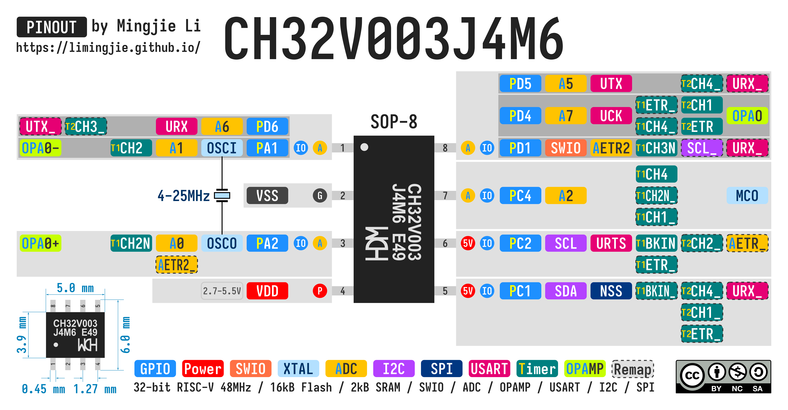
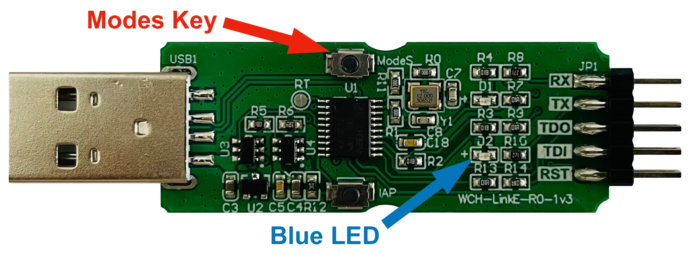

# CH32V003 Development Guide

- [CH32V003 Development Guide](#ch32v003-development-guide)
  - [Pinouts](#pinouts)
    - [CH32V003J4M6 Pinout](#ch32v003j4m6-pinout)
    - [CH32V003F4P6 Pinout](#ch32v003f4p6-pinout)
  - [Development Environments](#development-environments)
    - [Option 1 - MounRiver Studio](#option-1---mounriver-studio)
    - [Option 2 - ch32fun](#option-2---ch32fun)
      - [Compiling and Uploading (macOS)](#compiling-and-uploading-macos)
      - [Build `minichlink` Utility (macOS)](#build-minichlink-utility-macos)
      - [Unbrick CH32V003J4M6](#unbrick-ch32v003j4m6)
    - [Option 3 - PlatformIO](#option-3---platformio)
  - [Programming CH32V003](#programming-ch32v003)
    - [Wiring the CH32V003 to WCH-LinkE](#wiring-the-ch32v003-to-wch-linke)
    - [Switch WCH-LinkE to RISC-V Mode](#switch-wch-linke-to-risc-v-mode)
  - [References](#references)
  - [License](#license)

## Pinouts

### CH32V003J4M6 Pinout



### CH32V003F4P6 Pinout


## Development Environments

~~WCH usually does not provide good development support for macOS or Linux.~~ Thanks to the open source community, there are always enthusiasts who port the development environment. Kudos to you!

### Option 1 - MounRiver Studio

[MounRiver Studio](http://www.mounriver.com/) is the official WCH development environment. However, it only supports Windows, so I have never tried it since I do not have a Windows environment.

### Option 2 - ch32fun

I started developing for the CH32V003 with [Stefan Wagner's CH32V003 RISC-V Mini Game Console](https://github.com/wagiminator/CH32V003-GameConsole). It is a great experience to begin with Stefan's projects, as there are always clear guides and the projects are self-contained. I then moved to [CNLohr's ch32fun](https://github.com/cnlohr/ch32fun), formerly ch32v003fun, as there are many useful examples.

#### Compiling and Uploading (macOS)

Install the [RISC-V Toolchain](https://github.com/riscv-software-src/homebrew-riscv):

```shell
brew tap riscv-software-src/riscv
brew install riscv-tools
```

This project uses the `minichlink` utility to upload, so `libusb` is required as a dependency.

```shell
brew install libusb
```

Clone the project, connect the board to the programmer, then run the `make` command to compile and upload the firmware.

```shell
git clone https://github.com/cnlohr/ch32fun.git
cd ch32fun/examples/blink
make
```

#### Build `minichlink` Utility (macOS)

The `minichlink` utility in the `tools` library is built for `x86_64`. If your macOS runs on Apple Silicon, you can build the `minichlink` utility easily.

```shell
brew install pkg-config
brew install libusb
git clone https://github.com/cnlohr/ch32fun.git
cd ch32fun/minichlink
make
```

#### Unbrick CH32V003J4M6

The `PD1/SWDIO`, `PD4`, and `PD5` share the same pin on the CH32V003J4M6. After uploading a program, sometimes it is not possible to upload again. Use the `minichlink -u` command to clear all code flash (unbrick) and then upload.

```shell
minichlink -u
```

### Option 3 - PlatformIO

The [platform-ch32v](https://github.com/Community-PIO-CH32V/platform-ch32v) project provides PlatformIO support for the CH32V series of chips. Follow the [documentation](https://pio-ch32v.readthedocs.io/en/latest/installation.html) to set up the environment.

The project seems to use the WCH official header files directly. I tried porting some code to PlatformIO, and it is quite easy as long as I change the registers directly instead of calling the functions. There are some differences in macro names.

## Programming CH32V003

To program the CH32V003 microcontroller, you will need a programmer that supports SWD.

- The official [WCH-LinkE](https://www.wch-ic.com/products/WCH-Link.html) programmer.
- Check [CNLohr's ch32fun](https://github.com/cnlohr/ch32fun) project for other options, such as ESP32S2 and Arduino-based programmers.

### Wiring the CH32V003 to WCH-LinkE

| WCH-LinkE | CH32V003 |
| --------- | -------- |
| SWDIO     | SWIO     |
| GND       | GND      |
| 3V3       | VDD      |

### Switch WCH-LinkE to RISC-V Mode

If the blue LED on the WCH-LinkE is always on, it is in ARM mode. To program the CH32V003, it needs to be in RISC-V mode. Hold the Modes key while plugging it into the USB port.



## References

- [Stefan Wagner: CH32V003 RISC-V Mini Game Console](https://github.com/wagiminator/CH32V003-GameConsole)
- [CNLohr: ch32fun](https://github.com/cnlohr/ch32fun)
- [RISC-V Software: homebrew-riscv](https://github.com/riscv-software-src/homebrew-riscv)

## License


This work is licensed under a [Creative Commons Attribution-NonCommercial-ShareAlike 4.0 International License (CC BY-NC-SA 4.0)](https://creativecommons.org/licenses/by-nc-sa/4.0/).

**You are free to:**

- **Share** — copy and redistribute the material in any medium or format
- **Adapt** — remix, transform, and build upon the material

The licensor cannot revoke these freedoms as long as you follow the license terms.

**Under the following terms:**

- **Attribution** - You must give appropriate credit, provide a link to the license, and indicate if changes were made. You may do so in any reasonable manner, but not in any way that suggests the licensor endorses you or your use.
- **NonCommercial** - You may not use the material for commercial purposes.
- **ShareAlike** - If you remix, transform, or build upon the material, you must distribute your contributions under the same license as the original.
- **No additional restrictions** — You may not apply legal terms or technological measures that legally restrict others from doing anything the license permits.

**Notices:**

You do not have to comply with the license for elements of the material in the public domain or where your use is permitted by an applicable exception or limitation .

No warranties are given. The license may not give you all of the permissions necessary for your intended use. For example, other rights such as publicity, privacy, or moral rights may limit how you use the material.
