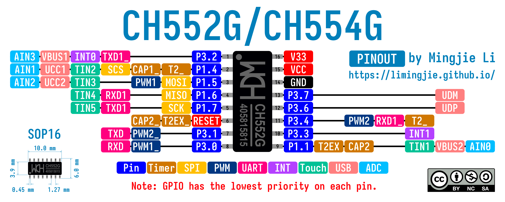

# CH55x

## CH552G/CH554G Pinout



| #   | Datasheet                         | Timer       | SPI  | PWM   | UART  | Timer | Touch | Interrupt | USB   | ADC  |
| --- | --------------------------------- | ----------- | ---- | ----- | ----- | ----- | ----- | --------- | ----- | ---- |
| 1   | P3.2/TXD1_/INT0/VBUS1/AIN3        |             |      |       | TXD1_ |       |       | INT0      | VBUS1 | AIN3 |
| 2   | P1.4/T2_/CAP1_/SCS/TIN2/UCC1/AIN1 | T2_/CAP1_   | SCS  |       |       |       | TIN2  |           | UCC1  | AIN1 |
| 3   | P1.5/MOSI/PWM1/TIN3/UCC2/AIN2     |             | MOSI | PWM1  |       |       | TIN3  |           | UCC2  | AIN2 |
| 4   | P1.6/MISO/RXD1/TIN4               |             | MISO |       | RXD1  |       | TIN4  |           |       |      |
| 5   | P1.7/SCK/TXD1/TIN5                |             | SCK  |       | TXD1  |       | TIN5  |           |       |      |
| 6   | RST/T2EX_/CAP2_                   | T2EX_/CAP2_ |      |       |       |       |       |           |       |      |
| 7   | P3.1/PWM2_/TXD                    |             |      | PWM2_ | TXD   |       |       |           |       |      |
| 8   | P3.0/PWM1_/RXD                    |             |      | PWM1_ | RXD   |       |       |           |       |      |
| 9   | P1.1/T2EX/CAP2/TIN1/VBUS2/AIN0    | T2EX/CAP2   |      |       |       |       | TIN1  |           | VBUS2 | AIN0 |
| 10  | P3.3/INT1                         |             |      |       |       |       |       | INT1      |       |      |
| 11  | P3.4/PWM2/RXD1_/T0                |             |      | PWM2  | RXD1_ | T0    |       |           |       |      |
| 12  | P3.6/UDP                          |             |      |       |       |       |       |           | UDP   |      |
| 13  | P3.7/UDM                          |             |      |       |       |       |       |           | UDM   |      |
| 14  | GND                               |             |      |       |       |       |       |           |       |      |
| 15  | VCC                               |             |      |       |       |       |       |           |       |      |
| 16  | V33                               |             |      |       |       |       |       |           |       |      |

### Documents

- [CH552 Datasheet - English](http://www.wch-ic.com/downloads/CH552DS1_PDF.html)
- [CH552 Datasheet - Chinese](https://www.wch.cn/downloads/CH552DS1_PDF.html)
- [CH554 Datasheet - English](http://wch-ic.com/downloads/CH554DS1_PDF.html)
- [CH554 Datasheet - Chinese](https://www.wch.cn/downloads/CH554DS1_PDF.html)

### Development Environment Setup

[SDCC](https://github.com/Blinkinlabs/ch554_sdcc) and [Arduino](https://github.com/DeqingSun/ch55xduino) are available for CH552 development.

#### Set up SDCC on macOS

1. Install `sdcc` and `binutils` (for objcopy).

    ```shell
    brew install sdcc
    brew install binutils
    ```

2. Install [CH55x flash tool](https://github.com/MarsTechHAN/ch552tool).

    ```shell
    brew install libusb
    python3 -mpip install ch55xtool
    ```

3. Clone [ch554_sdcc](https://github.com/Blinkinlabs/ch554_sdcc).

    ```shell
    git clone https://github.com/Blinkinlabs/ch554_sdcc.git
    ```

4. Change the Makefile.

   - Find the path of `objcopy`.

    ```shell
    find /opt/homebrew -name objcopy
    ```

   - Update Makefile

    ```Makefile
    OBJCOPY = /opt/homebrew/Cellar/binutils/<version>/bin/objcopy
    WCHISP ?= python3 -m ch55xtool -f
    ```

5. Build and flash the examples.

   ```shell
    cd ch554_sdcc/examples
    make
    make flash
    ```
