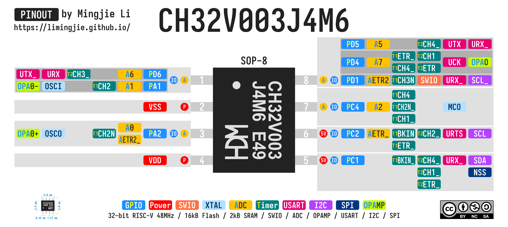

# PINOUTS

- [PINOUTS](#pinouts)
  - [WCH CH32V Series](#wch-ch32v-series)
    - [CH32V003](#ch32v003)
      - [CH32V003J4M6 Pinout](#ch32v003j4m6-pinout)
  - [WCH CH55x Series](#wch-ch55x-series)
  - [WCH CH59x Series](#wch-ch59x-series)
    - [CH591F Pinout](#ch591f-pinout)
    - [CH592F Pinout](#ch592f-pinout)
  - [License](#license)

## WCH CH32V Series

### CH32V003

- CH32V003 Datasheet - [English](MCU/CH32V/Documents/CH32V003%20Datasheet%20V1.7%20-%20English.PDF) / [Chinese](MCU/CH32V/Documents/CH32V003%20Datasheet%20V1.7%20-%20Chinese.PDF) (Official Website: [English](https://wch-ic.com/downloads/CH32V003DS0_PDF.html) / [Chinese](https://www.wch.cn/downloads/CH32V003DS0_PDF.html))
- CH32V003 Reference Manual - [English](MCU/CH32V/Documents/CH32V003%20Reference%20Manual%20V1.7%20-%20English.PDF) / [Chinese](MCU/CH32V/Documents/CH32V003%20Reference%20Manual%20V1.8%20-%20Chinese.PDF) (Official Website: [English](https://wch-ic.com/downloads/CH32V003RM_PDF.html) / [Chinese](https://www.wch.cn/downloads/CH32V003RM_PDF.html))
- [CH32V003 Evaluation Board](MCU/CH32V/Documents/CH32V003EVT.ZIP) ([Official Website](https://www.wch.cn/downloads/CH32V003EVT_ZIP.html))

#### CH32V003J4M6 Pinout

The timer mapping of the CH32V003 is really complex!

## WCH CH55x Series

- CH552 Datasheet - [English](MCU/CH55x/Documents/CH552%20Datasheet%20V1.8%20-%20English.PDF) / [Chinese](MCU/CH55x/Documents/CH552%20Datasheet%20V1.8%20-%20English.PDF) (Official Website: [English](https://wch-ic.com/downloads/CH552DS1_PDF.html) / [Chinese](https://www.wch.cn/downloads/CH552DS1_PDF.html))
- CH554 Datasheet - [English](MCU/CH55x/Documents/CH554%20Datasheet%20V1.8%20-%20English.PDF) / [Chinese](MCU/CH55x/Documents/CH554%20Datasheet%20V2.1%20-%20Chinese.PDF) (Official Website: [English](https://wch-ic.com/downloads/CH554DS1_PDF.html) / [Chinese](https://www.wch.cn/downloads/CH554DS1_PDF.html))
- [CH554 Evaluation Board](MCU/CH55x/Documents/CH554EVT.ZIP) ([Official Website](https://www.wch.cn/downloads/CH554EVT_ZIP.html))

## WCH CH59x Series

- CH592 Datasheet - [English](MCU/CH59x/Documents/CH592%20Datasheet%20V1.7%20-%20English.PDF) / [Chinese](MCU/CH59x/Documents/CH592%20Datasheet%20V1.8%20-%20Chinese.PDF) (Official Website: [English](https://www.wch-ic.com/downloads/CH592DS1_PDF.html) / [Chinese](https://www.wch.cn/downloads/CH592DS1_PDF.html))
- [CH592 Evaluation Board](MCU/CH59x/Documents/CH592EVT.ZIP) ([Official Website](https://www.wch.cn/downloads/CH592EVT_ZIP.html))

### CH591F Pinout

### CH592F Pinout

## License

This work is licensed under a [Creative Commons Attribution-NonCommercial-ShareAlike 4.0 International License (CC BY-NC-SA 4.0)](https://creativecommons.org/licenses/by-nc-sa/4.0/).

- Attribution - You must give appropriate credit, provide a link to the license, and indicate if changes were made. You may do so in any reasonable manner, but not in any way that suggests the licensor endorses you or your use.
- NonCommercial - You may not use the material for commercial purposes.
- ShareAlike - If you remix, transform, or build upon the material, you must distribute your contributions under the same license as the original.
