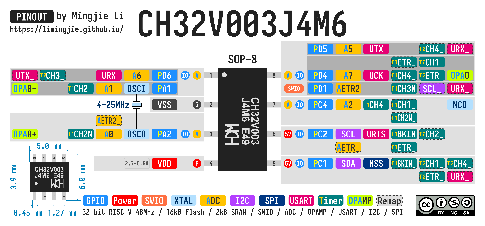
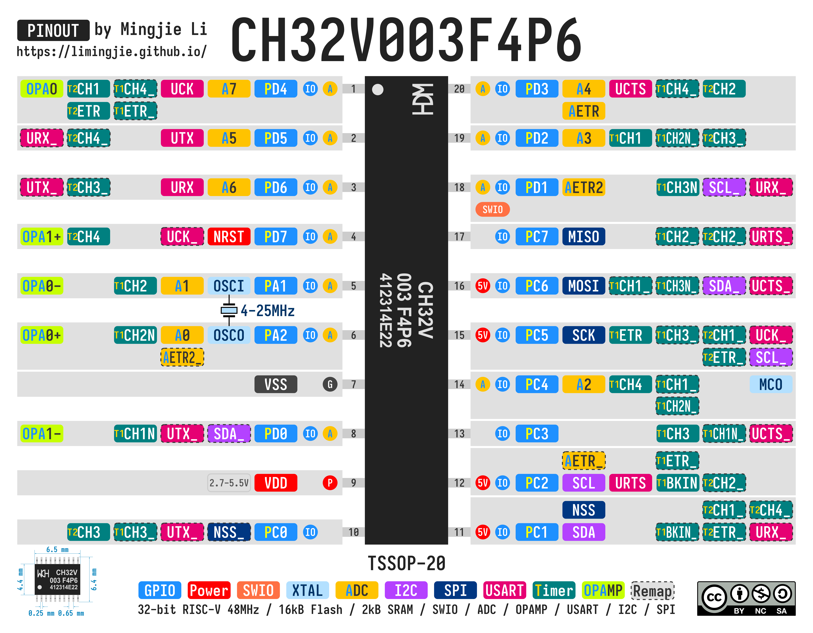
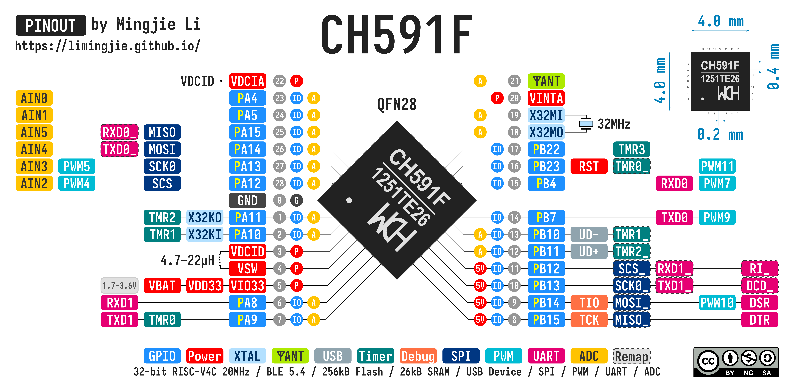
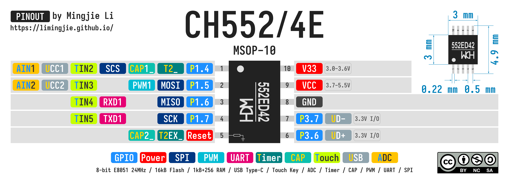

# WCH MCU Pinouts

- [WCH MCU Pinouts](#wch-mcu-pinouts)
  - [WCH RISC-V Series](#wch-risc-v-series)
    - [CH32V003 Development Guide](#ch32v003-development-guide)
    - [CH32V003 Pinouts](#ch32v003-pinouts)
  - [WCH Bluetooth Wireless Series](#wch-bluetooth-wireless-series)
    - [CH591F/CH592F Pinouts](#ch591fch592f-pinouts)
  - [WCH 8-bit Enhanced USB MCUs](#wch-8-bit-enhanced-usb-mcus)
    - [CH552G/CH554G Development Guide](#ch552gch554g-development-guide)
    - [CH552/CH554 Pinouts](#ch552ch554-pinouts)
  - [License](#license)

## WCH RISC-V Series

- CH32V003 Datasheet - [English](MCU/CH32V/Documents/CH32V003%20Datasheet%20V1.7%20-%20English.PDF) / [Chinese](MCU/CH32V/Documents/CH32V003%20Datasheet%20V1.7%20-%20Chinese.PDF) (Official Website: [English](https://wch-ic.com/downloads/CH32V003DS0_PDF.html) / [Chinese](https://www.wch.cn/downloads/CH32V003DS0_PDF.html))
- CH32V003 Reference Manual - [English](MCU/CH32V/Documents/CH32V003%20Reference%20Manual%20V1.7%20-%20English.PDF) / [Chinese](MCU/CH32V/Documents/CH32V003%20Reference%20Manual%20V1.8%20-%20Chinese.PDF) (Official Website: [English](https://wch-ic.com/downloads/CH32V003RM_PDF.html) / [Chinese](https://www.wch.cn/downloads/CH32V003RM_PDF.html))
- [CH32V003 Evaluation Board](MCU/CH32V/Documents/CH32V003EVT.ZIP) ([Official Website](https://www.wch.cn/downloads/CH32V003EVT_ZIP.html))

### CH32V003 Development Guide

[CH32V003 Development Guide](./MCU/CH32V/README.md)

### CH32V003 Pinouts

## WCH Bluetooth Wireless Series

- CH592 Datasheet - [English](MCU/CH59x/Documents/CH592%20Datasheet%20V1.7%20-%20English.PDF) / [Chinese](MCU/CH59x/Documents/CH592%20Datasheet%20V1.8%20-%20Chinese.PDF) (Official Website: [English](https://www.wch-ic.com/downloads/CH592DS1_PDF.html) / [Chinese](https://www.wch.cn/downloads/CH592DS1_PDF.html))
- [CH592 Evaluation Board](MCU/CH59x/Documents/CH592EVT.ZIP) ([Official Website](https://www.wch.cn/downloads/CH592EVT_ZIP.html))

### CH591F/CH592F Pinouts

## WCH 8-bit Enhanced USB MCUs

- CH552 Datasheet - [English](MCU/CH55x/Documents/CH552%20Datasheet%20V1.8%20-%20English.PDF) / [Chinese](MCU/CH55x/Documents/CH552%20Datasheet%20V1.8%20-%20Chinese.PDF) (Official Website: [English](https://wch-ic.com/downloads/CH552DS1_PDF.html) / [Chinese](https://www.wch.cn/downloads/CH552DS1_PDF.html))
- CH554 Datasheet - [English](MCU/CH55x/Documents/CH554%20Datasheet%20V1.8%20-%20English.PDF) / [Chinese](MCU/CH55x/Documents/CH554%20Datasheet%20V2.1%20-%20Chinese.PDF) (Official Website: [English](https://wch-ic.com/downloads/CH554DS1_PDF.html) / [Chinese](https://www.wch.cn/downloads/CH554DS1_PDF.html))
- [CH554 Evaluation Board](MCU/CH55x/Documents/CH554EVT.ZIP) ([Official Website](https://www.wch.cn/downloads/CH554EVT_ZIP.html))

### CH552G/CH554G Development Guide

[CH552G/CH554G Development Guide](./MCU/CH55x/README.md)

### CH552/CH554 Pinouts

## License

This work is licensed under a [Creative Commons Attribution-NonCommercial-ShareAlike 4.0 International License (CC BY-NC-SA 4.0)](https://creativecommons.org/licenses/by-nc-sa/4.0/).

**You are free to:**

- **Share** — copy and redistribute the material in any medium or format
- **Adapt** — remix, transform, and build upon the material

The licensor cannot revoke these freedoms as long as you follow the license terms.

**Under the following terms:**

- **Attribution** - You must give appropriate credit, provide a link to the license, and indicate if changes were made. You may do so in any reasonable manner, but not in any way that suggests the licensor endorses you or your use.
- **NonCommercial** - You may not use the material for commercial purposes.
- **ShareAlike** - If you remix, transform, or build upon the material, you must distribute your contributions under the same license as the original.
- **No additional restrictions** — You may not apply legal terms or technological measures that legally restrict others from doing anything the license permits.

**Notices:**

You do not have to comply with the license for elements of the material in the public domain or where your use is permitted by an applicable exception or limitation.

No warranties are given. The license may not give you all of the permissions necessary for your intended use. For example, other rights such as publicity, privacy, or moral rights may limit how you use the material.
